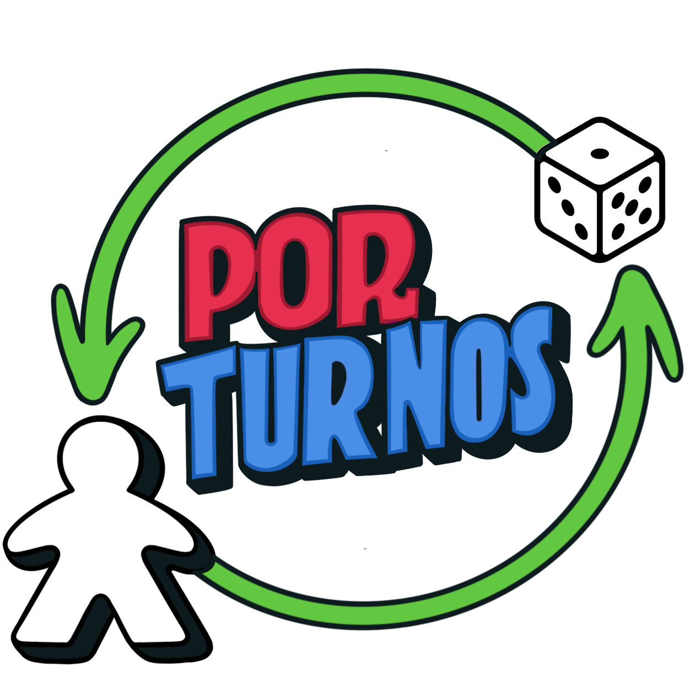

# 🎲 Por Turnos - Plataforma C2C de Juegos de Mesa



**Por Turnos** es una plataforma C2C (consumer-to-consumer) especializada en la compra, venta y reventa de juegos de mesa nuevos y usados. Busca fomentar la reutilización, el consumo responsable y la creación de una comunidad lúdica segura donde los entusiastas de los juegos de mesa puedan conectar, intercambiar y compartir su pasión.

## 🎯 Características Principales

- **Marketplace C2C**: Compra y venta directa entre usuarios
- **Gestión de Inventario**: Control de stock y disponibilidad
- **Sistema de Comentarios**: Reviews y opiniones sobre productos
- **Blog Comunitario**: Espacio para compartir experiencias y reseñas
- **Transacciones Seguras**: Múltiples métodos de pago y seguimiento de ventas
- **Categorización Inteligente**: Organización por tipo, estado y disponibilidad

## 📌 Arquitectura del Proyecto

```
PorTurnos/
├── 📁 frontend/           # Interfaz de usuario
│   ├── index.html
│   ├── css/
│   ├── js/
│   └── assets/
├── 📁 backend/            # API REST + Base de Datos
│   ├── ejemplosBrunos/    # Colección de pruebas API
│   └── tiendita/          # Aplicación Spring Boot
└── 📄 README.md           # Este archivo
```

### Stack Tecnológico

| Capa | Tecnología | Versión |
|------|------------|---------|
| **Frontend** | HTML5, CSS3, JavaScript | ES6+ |
| **Backend** | Java + Spring Boot | 21 + 3.5.4 |
| **Base de Datos** | MySQL | 8.0+ |
| **Herramientas** | DBeaver, Bruno, Maven | Latest |
| **Control de Versiones** | Git | - |

## 🚀 Instalación y Configuración

### Prerrequisitos

- **Java 21**
- **Maven 3.9.10**
- **MySQL 8.0+**
- **Git**
- Navegador web moderno

### 1. Clonar el Repositorio

```bash
git clone <URL_REPOSITORIO>
cd PorTurnos
```

### 2. Configurar la Base de Datos

```sql
CREATE DATABASE por_turnos_db;
CREATE USER 'por_turnos_user'@'localhost' IDENTIFIED BY 'tu_password';
GRANT ALL PRIVILEGES ON por_turnos_db.* TO 'por_turnos_user'@'localhost';
FLUSH PRIVILEGES;
```

### 3. Configurar el Backend

```bash
cd backend/tiendita

# Configurar variables de entorno
cp .env.example .env
# Editar .env con tus credenciales de base de datos

# Instalar dependencias y ejecutar
mvn clean install
mvn spring-boot:run
```

### 4. Ejecutar el Frontend

```bash
cd frontend

# Opción 1: Abrir directamente
open index.html

# Opción 2: Servidor local (recomendado)
python -m http.server 8081
# o
npx serve .
```

### 5. Verificar Instalación

- **Backend API**: http://localhost:8080
- **Frontend**: http://localhost:8081
- **Base de Datos**: Verificar conexión en DBeaver

## 📊 Modelo de Datos

### Entidades Principales

- **👤 Clientes**: Usuarios compradores y vendedores
- **🎲 Productos**: Items publicados en el marketplace
- **💬 Comentarios**: Reviews y opiniones
- **📝 Blogs**: Contenido comunitario
- **💰 Ventas**: Transacciones completadas

### Diagrama ER Simplificado

```
CLIENTES ──┐
           ├── PRODUCTOS ── COMENTARIOS
           ├── BLOGS
           └── VENTAS
```

*Para el diagrama completo, ver [backend/README.md](backend/README.md)*

## 🔧 API Endpoints

### Principales Endpoints

| Método | Endpoint | Descripción |
|--------|----------|-------------|
| `GET` | `/api/productos` | Listar productos disponibles |
| `POST` | `/api/productos` | Publicar nuevo producto |
| `GET` | `/api/clientes/{id}` | Obtener perfil de cliente |
| `POST` | `/api/ventas` | Registrar nueva venta |
| `GET` | `/api/blogs` | Listar posts del blog |

## 🧪 Testing

### Ejecutar Tests

```bash
cd backend/tiendita
mvn test
```

### Probar API con Bruno

1. Importar colección desde `backend/ejemplosBrunos/`
2. Configurar variables de entorno
3. Ejecutar tests de endpoints

## 🤝 Contribución

### Flujo de Trabajo

1. **Fork** del proyecto
2. Crear **branch** para nueva feature: `git checkout -b feature/nueva-funcionalidad`
3. **Commit** de cambios: `git commit -m 'Agregar nueva funcionalidad'`
4. **Push** al branch: `git push origin feature/nueva-funcionalidad`
5. Crear **Pull Request**

### Estándares de Código

- **Java**: Seguir convenciones de Oracle y Spring
- **SQL**: Nombres en snake_case
- **Frontend**: Estándares HTML5/CSS3/ES6+
- **Commits**: Formato convencional

## 📈 Roadmap

### Versión 1.0 (MVP)

- ✅ Backend educativo en Spring Boot.
- ✅ Implementación de DTOs para Requests y Responses.
- ✅ Uso de Spring Data JPA con Pageable.
- ✅ Sistema de usuarios y autenticación
- ✅ CRUD de productos
- ✅ Sistema de comentarios y blog
- ✅ Gestión de ventas
- ⏳ Frontend responsivo

## 🛡️ Seguridad

- **Autenticación JWT**
- **Configuración modular con .env**
- **Validación de entrada**
- **Roles y control de acceso a endpoints**

## 📚 Documentación Adicional

- [🔧 Backend - Documentación Técnica](backend/README.md)
- [⚙️ API - Configuración Spring Boot](backend/tiendita/README.md)
- [🧪 Bruno - Colección de Tests](backend/ejemplosBrunos/)

## 👥 Equipo de Desarrollo

| Desarrollador |
|---------------|
| **Angelo Grigoletti** |
| **Natalie Duchens** |
| **Robinson Rojas** |
| **Kiara Iza** |

---

**Por Turnos** - *Conectando comunidades lúdicas* 🎲✨